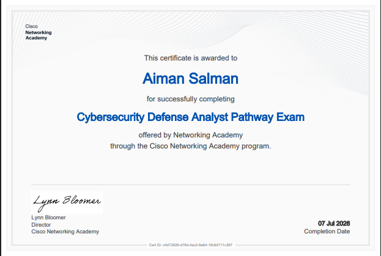

# 👋 Hi, I'm Aiman Salman

### Cyber Security Student • Security Tester • Red Team & Cloud Security Enthusiast

 

&nbsp;

&nbsp;

&nbsp;

  

---

---

## 👩‍💻 About Me

<table>
<tr>
<td width="60%">

I'm **Aiman Salman**, a Cyber Security student focused on building practical security skills through hands-on labs, projects, and continuous learning.

### 🔐 Current Interests

* Web Application Security & Penetration Testing
* Reconnaissance and Security Testing
* Red Team Techniques
* Cloud Security
* Linux & Security Tooling
* Python for Security Automation
* CTFs, Vulnerable Labs & Practical Security Research

> 🎯 **Current focus:** Strengthening my penetration-testing foundation and gradually moving toward cloud security.

</td>

<td width="40%" align="center">

  

**Learning by Building • Breaking • Securing**

</td>
</tr>
</table>

---

## 🛡️ Security Toolkit

 

  

  

---

## ⚙️ Tech Stack

 

---

## 📊 GitHub Overview

 

  

---

## 🟩 GitHub Contribution Calendar

 

---

---

## 📜 Certificates

 

<table>
<tr>
<td align="center">

### Cisco Networking Academy

**Cybersecurity Defense Analyst Pathway Exam**

 

  

</td>
</tr>
</table>

---

## 📂 Featured Repositories

 

<table>
<tr>

<td width="50%" align="center">

### 🔎 Recon Framework

  

Reconnaissance framework for security testing and information gathering.

  

`Python` `Recon` `OSINT` `Security`

</td>

<td width="50%" align="center">

### 🧪 Cyber Intern Projects

  

Cybersecurity internship projects and practical security tasks.

  

`Python` `Cyber Security` `Projects`

</td>

</tr>

<tr>

<td width="50%" align="center">

### 🛡️ Security Audit Report

  

Security auditing and reconnaissance research project.

  

`Nmap` `Shodan` `Nikto` `Recon`

</td>

<td width="50%" align="center">

### ⚔️ Cyber Security Research

  

Practical cybersecurity learning, experiments, and research.

  

`Security` `Linux` `Research`

</td>

</tr>
</table>

---

## 🎯 What I'm Working On

<table>
<tr>
<td width="50%">

### 🌐 Web Pentesting

* Reconnaissance
* Authentication Security
* Session Security
* SQL Injection
* XSS
* CSRF
* IDOR / Access Control
* SSRF

</td>

<td width="50%">

### 🚀 Next

* Advanced Web Security
* Network Pentesting
* Cloud Security
* Security Automation
* Practical CTFs
* Vulnerable Lab Research

</td>
</tr>
</table>

---

## 🧠 Current Learning Path

 

`Web Security`
  →  
`Penetration Testing`
  →  
`Network Security`
  →  
`Cloud Security`

  

---

## 🔗 Connect With Me

 

---

### ⚡ Learn • Practice • Break • Secure

